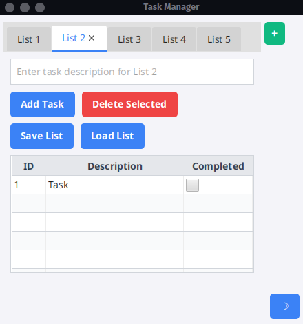

# Scala Task Manager

A simple, tabbed task management GUI application built with Scala 3.6.4 and ScalaFX. Manage multiple task lists, add tasks, mark them as completed, and save/load lists to/from JSON files.

## Features
- **Tabbed Interface**: Start with a default task list and create additional lists using the "+" button.
- **Task Management**: Add, delete, and mark tasks as completed in each tab.
- **Persistence**: Save task lists to JSON files and load them manually. The last-used list for each tab loads automatically on startup.
- **Cross-Platform**: Built with ScalaFX (JavaFX), runs on Linux, Windows, and macOS (tested on Arch Linux).

## Screenshots


## Prerequisites
- **Java Development Kit (JDK)**: JDK 17 or later (Java 24 tested).
- **Scala Build Tool (sbt)**: Version 1.10.1 or later.
- **Scala**: Version 3.6.4 (specified in `build.sbt`).

### On Arch Linux
```bash
sudo pacman -S jdk-openjdk sbt
